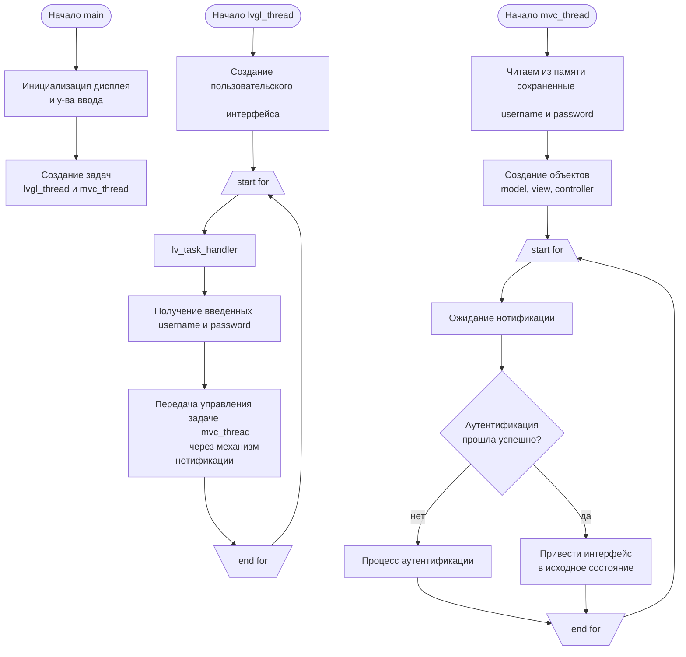
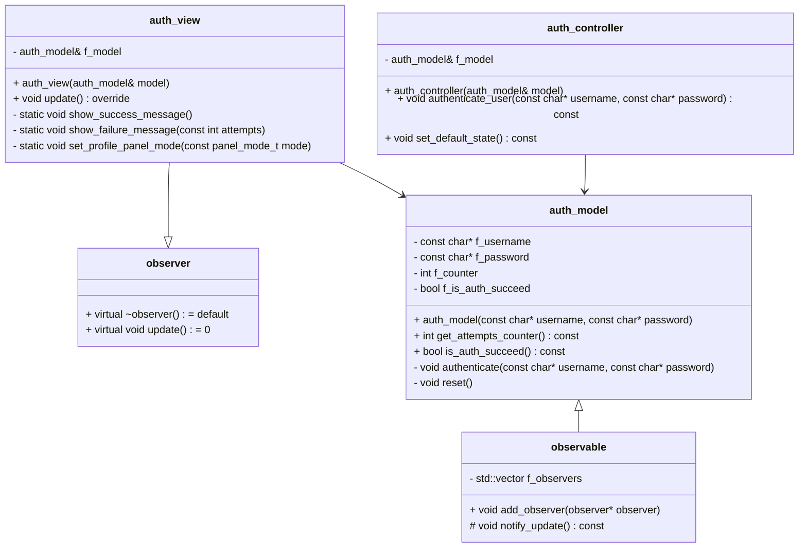

# Тестовое задание:

### Нужно реализовать MVC архитектурный паттерн на C++. В рамках приложения аутентификации (нужно предложить пользователю ввести пару логин пароль и, проверив, вывести сообщение об успехе-неуспехе).

- Платформы: STM32, Linux
- RTOS: FreeRTOS

**Требования:**

Для решения тестового задания код должен быть кросс-платформенным сборка основного таргета под OS Linux и arm gcc компилятор. Среда разработки на усмотрение разработчика. Очень круто будет иметь 2й билд таргет в виде GUI аппликейшна под линукс.

STM32 имеет ограниченные ресурсы - RAM/FLASH - код должен эти ограничения учитывать. В любой момент времени должна быть возможность узнать занятый объём динамической памяти и степень фрагментации. Универсальное решение не требуется (достаточно, чтобы такой контроль памяти применялся в отношении, например, конкретных классов). Можно использовать Heap механизм из FreeRTOS.

Графический интерфейс делать нужно на базе библиотеки LVGL. Весь UI должен выполняться в отдельном процессе FreeRTOS.

Аутентификационные данные хранить во флеше (файл в линуксе). Плюсом будет реализация счетчика попыток ввода пароля c блокировкой аккаунта при превышении лимита ошибок. 

Решение должно быть представлено в виде git-репозитория (github, gitlab, bitbucket). Наличие промежуточных коммитов с комментариями о ходе разработки приветствуется.

## Решение
- **app_tasks.cpp**
  
  Создаются две задачи: *task_lvgl* и *task_mvc* с более высоким приоритетом, чем *task_lvgl*.
    - ***task_lvgl*** Осуществляет отрисовку пользовательского интерфейса и обработку событий. В обработчике события нажатия на кнопку "Log in" вызывается функция *update_log_pass()*, и она в свою очередь уведомляет задачу *task_mvc*, чтобы она начала выполнение. В данном случае, переключение на работу задачи *task_mvc* осуществляется с помощью механизма нотификаций.
    - ***task_mvc*** Создает локально объекты *model*, *view*, *controller* и ожидает уведомление с помощью механизма нотификаций. После получения уведомления, обрабатывает введенные *username* и *password* и показывает результат на экране.

  Взаимодействие с LVGL (вывод текстовых сообщений, изменение состояния текстовых полей и кнопок) осуществлятся с помощью мьютексов.

  В программе нет необходимости использовать *unique_ptr* или *shared_ptr*, т.к. не происходит динамического выделения памяти.

## Блок-схема программы:

## Диаграмма классов:

## Использованные возможности C++11 и выше:

- **Class auth_model:**
    - Атрибут ***constexpr*** при использовании константных выражений и констант времени компиляции.
    - Использование переменных типа инициализирующего значения (ключевое слово ***auto*** в указании типа).
    - Использование ***override***-спецификатора позволяют убедиться на этапе компиляции что мы действительно переопределили функцию базового класса.
    - Использование спецификатора ***final*** запрещает наследование от текущего класса.
    - Использование ***explicit*** в объявлении конструктора для исключения неявных преобразований типов.
    - (C++17) Атрибут ***[[nodiscard]]*** для указания необходимости использования возвращаемого значения.

- **Class auth_view:**
    - Атрибут ***constexpr*** при использовании константных выражений и констант времени компиляции.
    - Использование переменных типа инициализирующего значения (ключевое слово ***auto*** в указании типа).
    - Использование ***override***-спецификатора позволяют убедиться на этапе компиляции что мы действительно переопределили функцию базового класса.
    - Использование спецификатора ***final*** запрещает наследование от текущего класса.
    - Использование ***перечисления со строгой типизацией*** (enum class panel_mode_t).
    - Использование ***explicit*** в объявлении конструктора для исключения неявных преобразований типов.
    - (C++17) ***Инициализация локальной переменной в if***.
 
- **Class auth_controller:**
    - Использование ***explicit*** в объявлении конструктора для исключения неявных преобразований типов.

- **observable.cpp**
    - Использование ***range-based for***.
    - Использование переменных типа инициализирующего значения (ключевое слово ***auto*** в указании типа).

- **app_tasks.cpp**
    - Использование **cписка инициализации** g_log_pass = { username, password }.
    - Использование ключевого слова ***nullptr*** для описания константы нулевого указателя.
    - Использование директивы ***using*** для создания псевдонима типа данных.

- **app.h, app.cpp**
    - Использование ***перечисления со строгой типизацией*** (enum class error_code_t).
    - (C++17) ***Инициализация локальной переменной в if***.

- **gui_app.h, gui_app.cpp**
    - Атрибут ***constexpr*** при использовании константных выражений и констант времени компиляции.
    - Использование переменных типа инициализирующего значения (ключевое слово ***auto*** в указании типа).
    - Использование ключевого слова ***nullptr*** для описания константы нулевого указателя.
    - (C++17) ***Инициализация локальной переменной в if***.
 
- **memory.h, memory.cpp**
    - Атрибут ***constexpr*** при использовании константных выражений и констант времени компиляции.
    - Использование переменных типа инициализирующего значения (ключевое слово ***auto*** в указании типа).
    - (C++17) ***Инициализация локальной переменной в if***.
 
- **static_string.h**
    - Атрибут ***constexpr*** при использовании константных выражений и констант времени компиляции.
    - Использование переменных типа инициализирующего значения (ключевое слово ***auto*** в указании типа).
    - Использование директивы ***using*** для создания псевдонима типа данных.
    - (C++17) Атрибут ***[[nodiscard]]*** для указания необходимости использования возвращаемого значения.

## Видео демонстрации работы

**Windows Simulator:**

------------------------------------------------------------------------------------------------------------

**Отладочная плата STM32F746G-DISCOVERY:**

